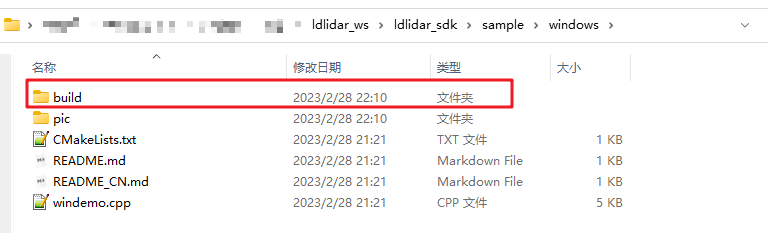
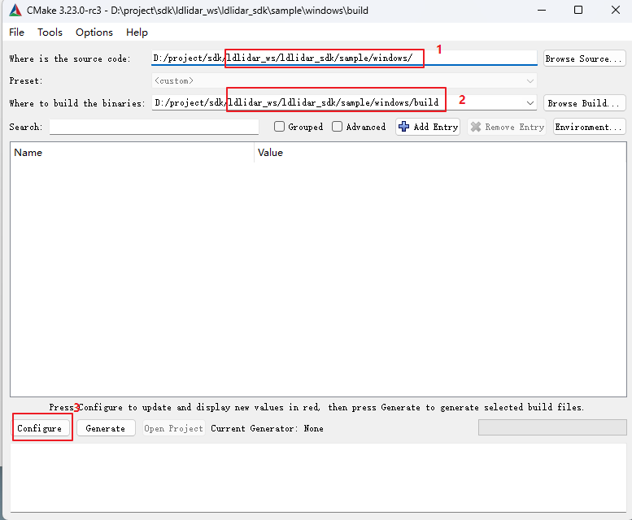
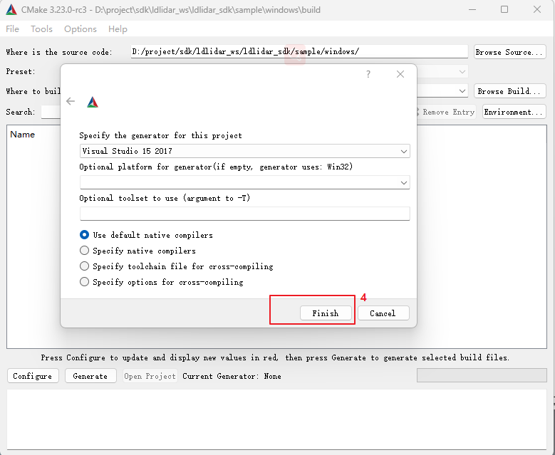
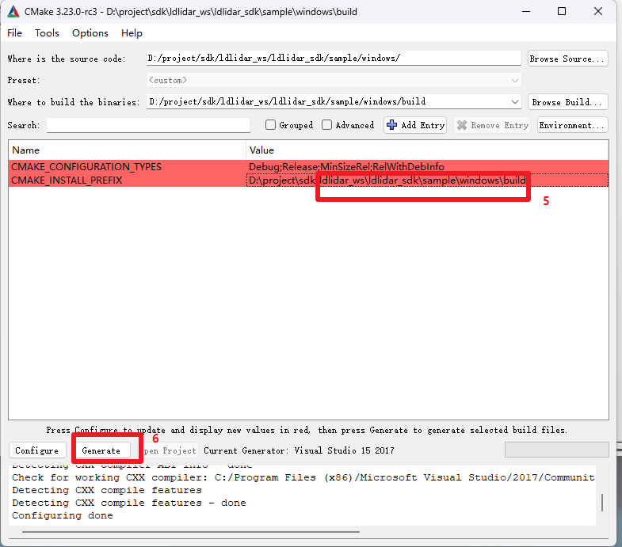
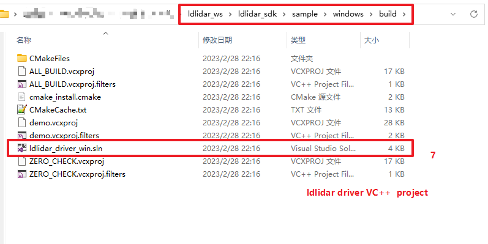
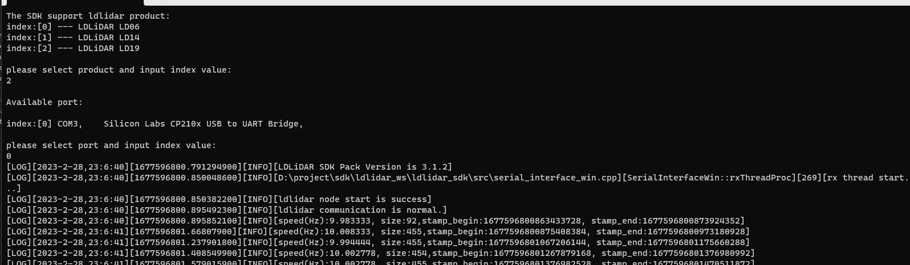

# 使用CMake生成visual studio C++ 工程
> 前提条件，PC上需要提前安装有visual studio IDE 和 CMake Tool。

## 方法一：命令行方式
- 在`sample/windows`目录下打开powershell终端，以创建`Visual Studio 15 2017 Win64`环境下的C++工程为例，运行如下命令。
```powershell
mkdir build   # create `build` folder.

cd build

cmake -G "Visual Studio 15 2017 Win64" ../
```

## 方法二： CMake  GUI

- 在`sample/windows` 目录下创建`build` 文件夹

	- 

- 运行CMake GUI,完成相关配置，生成VC++工程并编译运行
	- 

	- 

	- 

	- 

	- 